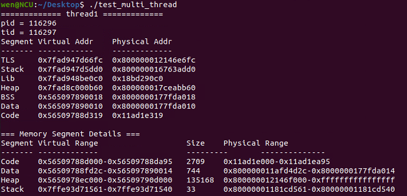
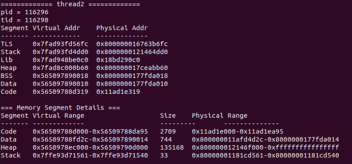
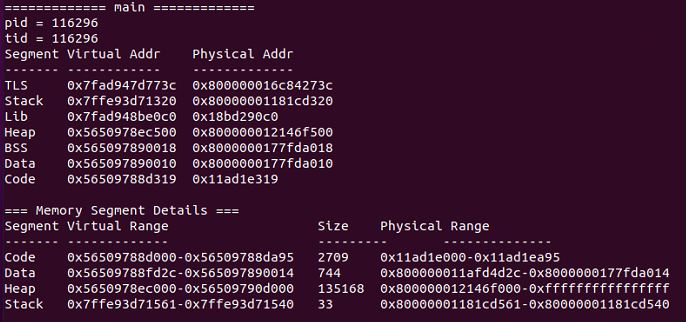

# Project 1
實作 system call ，功能是將使用者空間的 virtual address 轉為 physical address，並且取得每個 segment (text、data、BSS、heap、libraries、stack) 的起始位址、結束位址與大小。
透過 system call 來觀察不同的 thread 記憶體區段的共享情況，哪些 segment 會共用 memory。

## 檔案結構
```
linux-5.8.1
├─ proj1
│  ├─ get_vir_to_phy.c
│  ├─ get_segment.c
│  └─ Makefile
├─ Makefile
├─ arch/x86/entry/syscalls/syscall_64.tbl
├─ include/linux/syscalls.h
├─ ... 
```

## 編譯
1. 編譯 Kernel
2. 編譯程式
`gcc -o test_multi_thread test_multi_thread.c -pthread`
3. 執行程式
`./test_multi_thread`

## 範例輸出
- Process 和 Thread ID
- 各記憶體區段的虛擬地址和實體地址
- 各記憶體區段範圍和大小



